### In this post I will list my top favorite collection of shortcuts, performance tips, snippets, extensions that makes life a lot easier and faster when applying these `hot stuff`. So there it is, enjoy!

---

## Tips

### Restart TS Server

```Code
ctrl + shift + P -> TypeScript: Restart TS server
```

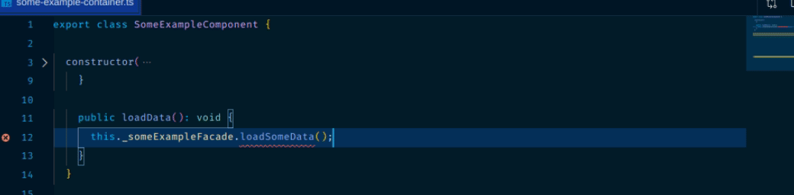

### Jump To Matching Bracket

```Code
shift + Ctrl + \
```

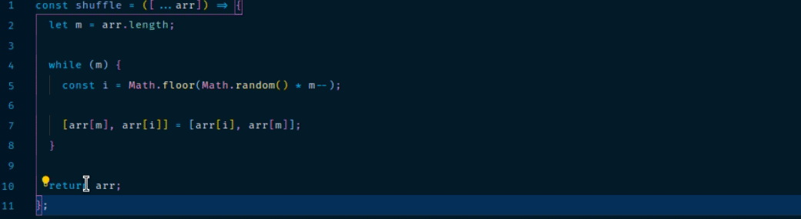

### Go to Entity (Functions, vars, etc)

```Code
ctrl + shift + O
```

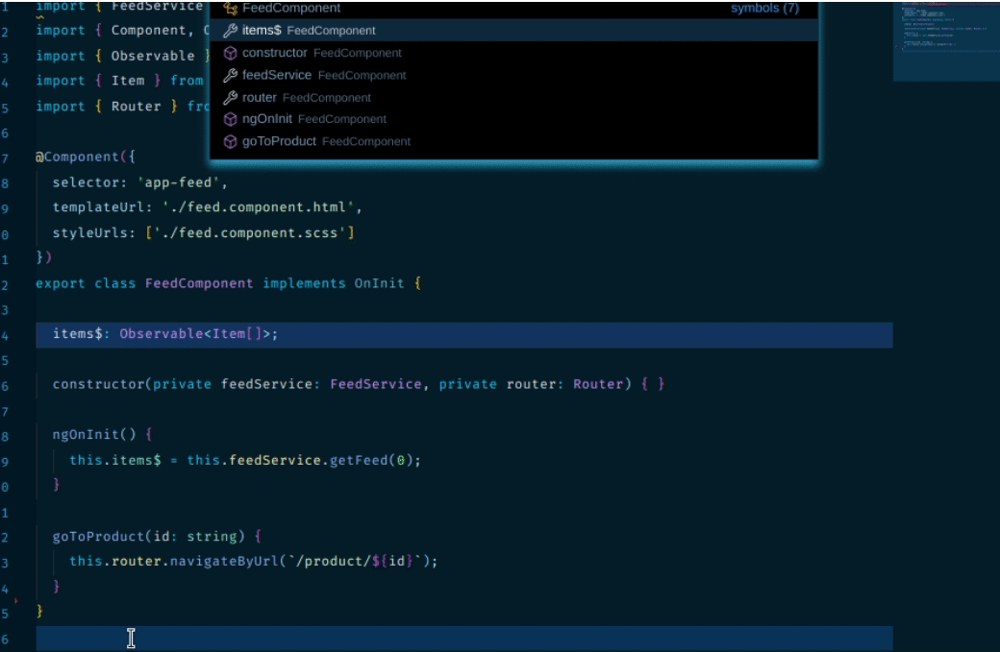

### Remove open editors

To save some space we can hide open editors tab which is not so useful.

```Code
Settings -> Open editors -> set to 0
```

### Disable GPU acceleration

Sometimes you can have issue related to how the GPU is used to render VS Code's UI. Where is a trick to have a much better experience when running VS Code with the additional --disable-gpu command-line argument. Running with this argument will disable the GPU hardware acceleration and fall back to a software renderer.

### To add this flag:

- Open the Command Palette (Ctrl+Shift+P).
- Run the Preferences: Configure Runtime Arguments command.
- This command will open a argv.json file to configure runtime arguments. You might see some default arguments there already.
- Add "disable-hardware-acceleration": true.
- Restart VS Code.

**_Note_**: Do not use this setting unless you are seeing issues

### Process Explorer

Do you find your VS code editor a bit slow sometimes? Ever wished you can take a peek at what is eating up your memory? Well if you haven't known this already VS code has a Process Explorer feature which will allow you to open up a window as shown below:

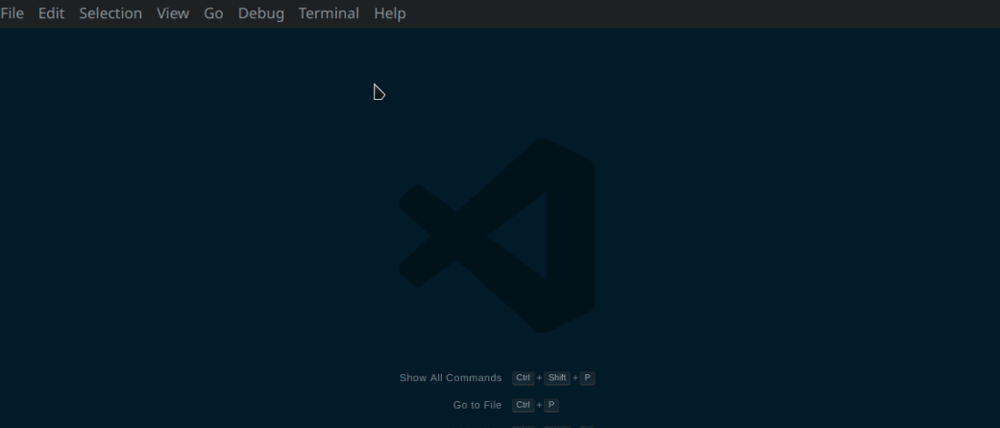

### Running Extensions

You can view all of your running extensions by opening up the command palette and typing Show Running extensions.

You're also given the information to see which extensions take longer than others on activation. If you were ever wondering why your editor was loading up slower than usual then your answer might be lying within this window:

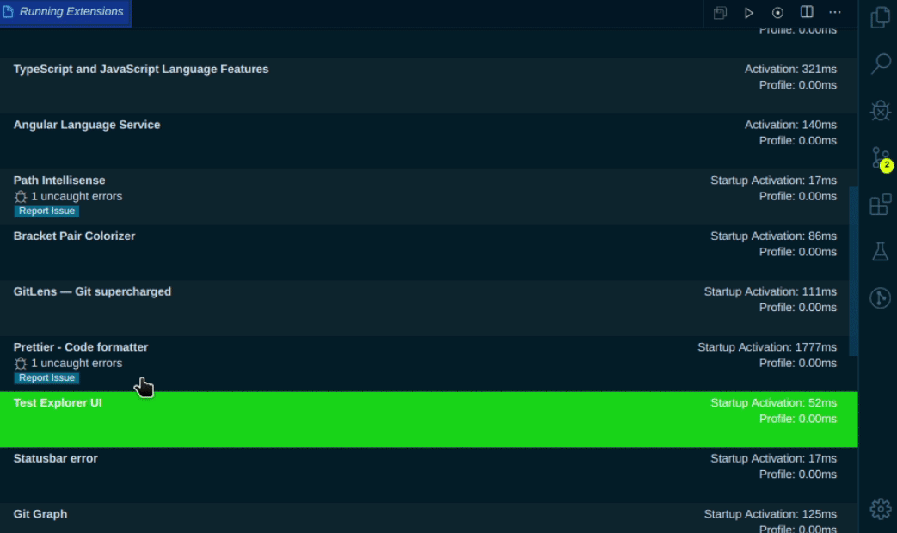

### Reload

It allows you to keep your window in front of you when reloading your editor while having the same effect as if you were to close and re-open it.

Press **_Ctrl + Alt + R_**, Or set keybinding personally, for myself i prefer **_Ctrl + R_**

### Startup Performance

Sometimes it can just be a pain in the behind when you're lacking further detail on performance issues while you're trying to find out why there is a performance issue in the first place.

And sometimes if you're lucky enough you'll find a tool that gives you all the answers. Open a useful window of miraculously all the information you need:

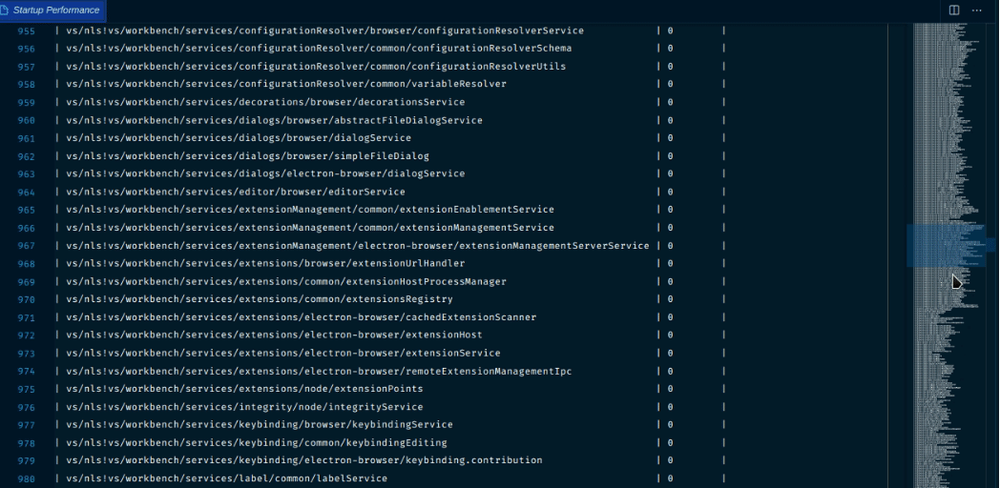

### Convert to optional chain

Many older codebases have a lot of repetitive null checks that optional chaining can simplify. Now it's easier than ever to automate some of this cleanup.

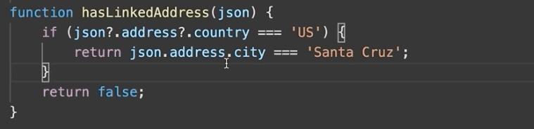

### Deprecated tag support for JavaScript and TypeScript

VS Code renders IntelliSense suggestions for deprecated properties with a strike through (see the show and hide suggestions below for example):

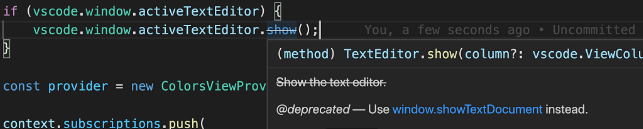

## Snippets

Add these snippets to your user snippets settings for rapid development

```json
Console": {
  "prefix": "log",
  "body": [
    "console.log('%c$1', 'color: green; font-size: 1.5rem;', $1);",
  ],
  "description": "Log output to console"
}
```

```json
"Create TFC component": {
  "prefix": "tfc",
  "body": [
    "import React from 'react';",
    "",
    "interface $1Props {}",
    "",
    "export const $1: $1Props = () => {",
    "  return <>Component</>;",
    "};",
    "",
    "export default $1;"
  ],
  "description": "Create react functional TS component"
}
```

```json
"Print data in JSX": {
  "prefix": "jsxpr",
  "body": ["<pre>{JSON.stringify($1, null, 2)}</pre>"],
  "description": "Print JSX data"
}
```

```json
"JSX map an array": {
  "prefix": "jsxmap",
  "body": ["{$1.map(item => (", "  <div key={item.id}></div>", "))}"],
  "description": "Map array in jsx"
}
```

## Extensions

### [Error lens](https://marketplace.visualstudio.com/items?itemName=usernamehw.errorlens)

Improve highlighting of errors, warnings and other language diagnostics. Append diagnostic descriptions to the end of the line. Show icons in gutter.

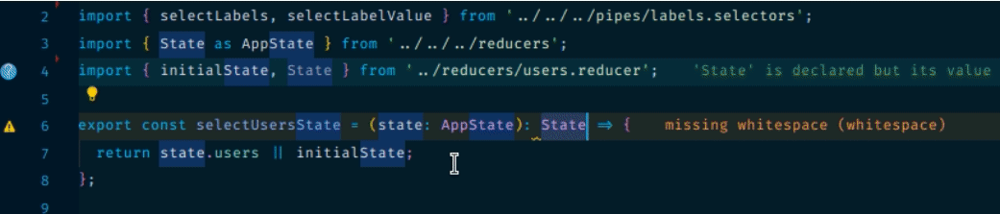

### [Git Graph](https://marketplace.visualstudio.com/items?itemName=mhutchie.git-graph)

View a Git Graph of your repository, and easily perform Git actions from the graph. Configurable to look the way you want!

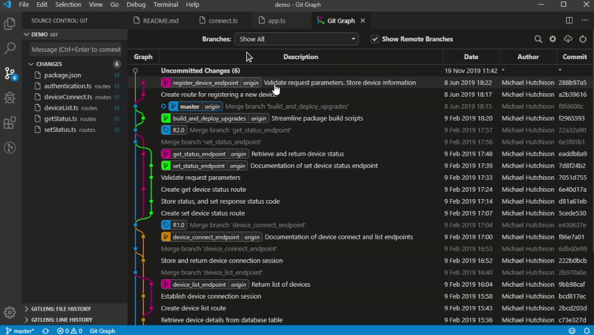

### [Abracadabra, refactor this!](https://marketplace.visualstudio.com/items?itemName=nicoespeon.abracadabra)

Automated refactorings for VS Code, in JavaScript and TypeScript. This one is `Huge`, you should check this at official site what goodies it handles. I just picked and dropped one of many examples:

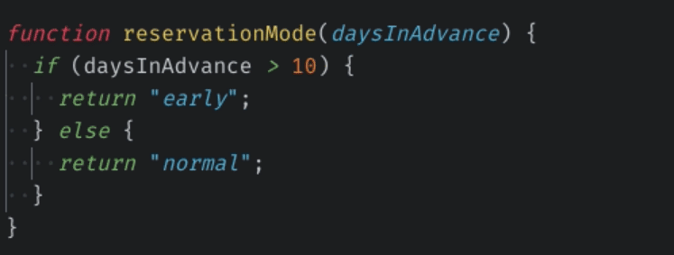

### [Stack Overflow View](https://marketplace.visualstudio.com/items?itemName=4tron.stack-overflow-view)

Integrated solution for searching and finding answers in Stack Overflow to not going anywhere from your VS Code


### [TypeScript Hero](https://marketplace.visualstudio.com/items?itemName=rbbit.typescript-hero)

When you are coding a lot of TypeScript you may want vscode to organize your imports. Just type **_ctrl + alt + O_**.

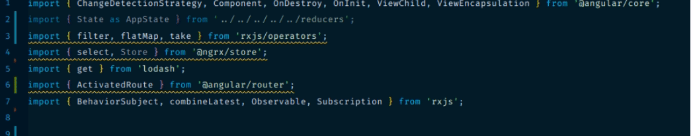

### [JSON to TS](https://marketplace.visualstudio.com/items?itemName=MariusAlchimavicius.json-to-ts)

Convert JSON object to typescript interfaces

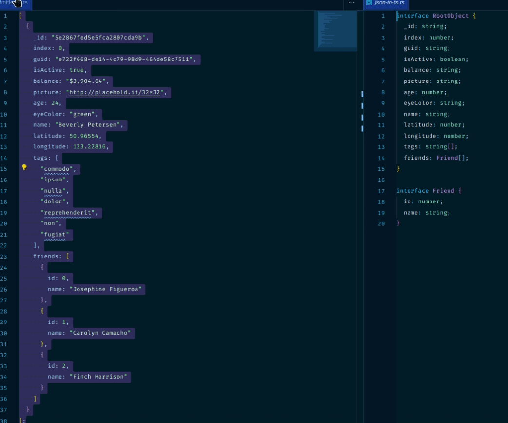

### [google-search](https://marketplace.visualstudio.com/items?itemName=MariusAlchimavicius.json-to-ts)

Well, if you are stuck in some confusion about what this or that line or this function does, then you can simply select the function or line you want and vola! you'll get instant search results for that query in your default web-browser without needing to type or copy the whole thing up!


---

## Bonus

Top favorite gorgeous looking `themes` you should check:

- [Cobalt](https://marketplace.visualstudio.com/items?itemName=wesbos.theme-cobalt2)
- [Shades of Purple](https://marketplace.visualstudio.com/items?itemName=ahmadawais.shades-of-purple)
- [Winter is Coming](https://marketplace.visualstudio.com/items?itemName=johnpapa.winteriscoming)

That's it. Be more productive and happier coder.
